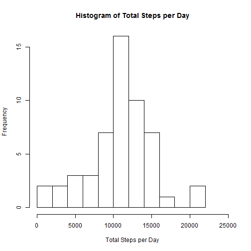
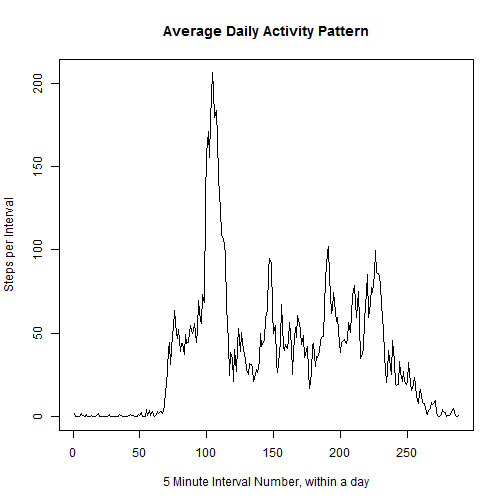
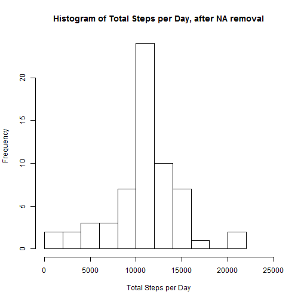
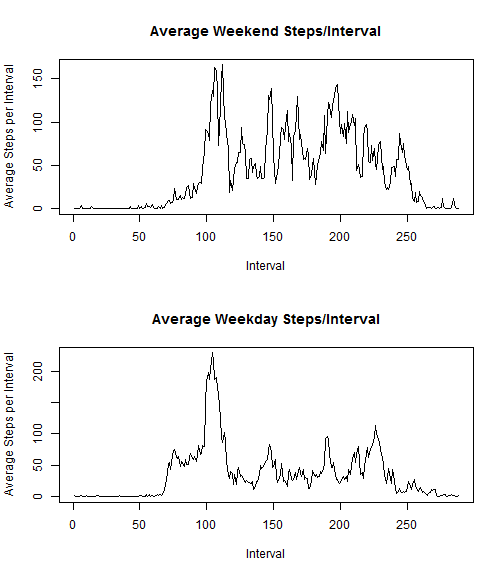

file name: PA1_template.Rmd


# Peer Assignment 1

This assignment makes use of data from a personal activity monitoring device. This device collects data at 5 minute intervals through out the day. The data consists of two months of data from an anonymous individual collected during the months of October and November, 2012 and include the number of steps taken in 5 minute intervals each day .

This assignment will examine how the number of steps taken varies with time of day and day of week

**First load libraries and data**


```r
    library(lubridate)

    file.name <- "activity.zip"

    # using http instead of https:
    URL <- "http://d396qusza40orc.cloudfront.net/repdata%2Fdata%2Factivity.zip"
    download.file(URL, destfile = file.name)
    unzip(file.name)

    activity <- read.csv("activity.csv")
```

    File  downloaded on Thu Aug 20 15:03:06 2015

    File contains: steps, date, interval

**Now calculate mean and median steps per day**


```r
    first.day     <- ymd(as.character(activity$date[1]))  # first day of test
    date_sv       <- ymd(as.character(activity$date))     # full date of each measurement
    # Calculate a relative day, e.g., 0,1,2....
    activity$date <- 
        round(as.numeric(as.duration(interval(first.day, ymd(as.character(activity$date)))))/86400)

    # Rename table variable
    names(activity)[2] <- "day"

    loc     <- !is.na(activity$steps)  # locations of valid data

    # Calculate total, mean, and median steps per day
     total.stepsperday  <- tapply(activity$steps[loc],activity$day[loc],sum)
      mean.stepsperday  <- mean(total.stepsperday)
    median.stepsperday  <- median(total.stepsperday)
```

    Reformatted file contains: steps, day, interval  

  **Mean steps per day is: 10766.19**    
**Median steps per day is: 10765**    

    Reformatted file contains: steps, day, interval


```r
    # Form histogram
    hist(total.stepsperday,breaks=11,xlim=c(0,25000),
         main="Histogram of Total Steps per Day",
         xlab="Total Steps per Day")
```

 


```r
    # Calculate mean steps per interval
    mean.stepsperinterval <- tapply(activity$steps[loc],as.factor(activity$interval[loc]),mean)
    plot(mean.stepsperinterval, type="l", 
         ylab="Steps per Interval", 
         xlab="Interval, in minutes within a day")
    title(main="Average Daily Activity Pattern")
```

 


```r
    # Find max
    max.stepsperinterval <- max(mean.stepsperinterval)
    mloc <- which.max(mean.stepsperinterval)
```

**Max Steps per interval is 206.1698113**    
**Max occurs at interval number 104 or minute 835 of the day**  

**Now correct for missing data:**


```r
        nmiss <- sum(is.na(activity$step))  # number of intervals with missing data

        activity_nm <- activity             # initialize new table
        loc_miss <- is.na(activity$steps)   # locations of missing data
        # Replace missing data with mean for that interval
        ptr <- rep(1:288,61)                # there are 288 intervals in each day, 61 days

        # Load means into places where data is missing
        activity_nm$steps[loc_miss] <- mean.stepsperinterval[ptr]

        # Calculate new mean after data correction
        mean.stepsperinterval2 <- tapply(activity_nm$steps, as.factor(activity_nm$interval),mean)

        # Calculate difference in pre/post correction means
        diffs <- mean.stepsperinterval2-mean.stepsperinterval

        # Find largest difference
        max_diff <- max(abs(diffs))

        # Calculate corrected statistics
         total.stepsperday2  <- tapply(activity_nm$steps,activity_nm$day,sum)
          mean.stepsperday2  <- mean(total.stepsperday2)
        median.stepsperday2  <- median(total.stepsperday2)
```

A total of 2304 intervals are missing data  
**Max difference in steps per day due to replacing NAs with mean of 5 min values is 0**    


```r
        # Form histogram
        hist(total.stepsperday2,breaks=11,xlim=c(0,25000),
             main = paste("Histogram of Total Steps per Day, after NA removal"),
             xlab="Total Steps per Day")
```

 
**Corrected statistics:**  
Mean Steps per Day 10766.19  
Median Steps per Day 10766.19  

**The mean is unchanged, but now the median equals the mean**


```r
wkday <- weekdays(date_sv)

loc_wend <- (wkday=="Saturday") | (wkday=="Sunday")

daytype <- rep("weekday",17568)
daytype[loc_wend] <- rep("weekend",length(loc_wend))
                        
activity_nm$daytype <- as.factor(daytype)


mean.weekday  <- tapply(activity_nm$steps[!loc_wend],as.factor(activity_nm$interval[!loc_wend]),mean)
mean.weekend  <- tapply(activity_nm$steps[ loc_wend],as.factor(activity_nm$interval[ loc_wend]),mean)
  
par(mfrow=c(2,1))

plot(mean.weekend,type="l",main="Average Weekend Steps/Interval",xlab="Interval",ylab="Average Steps per Interval")
plot(mean.weekday,type="l",main="Average Weekday Steps/Interval",xlab="Interval",ylab="Average Steps per Interval")
```

 
